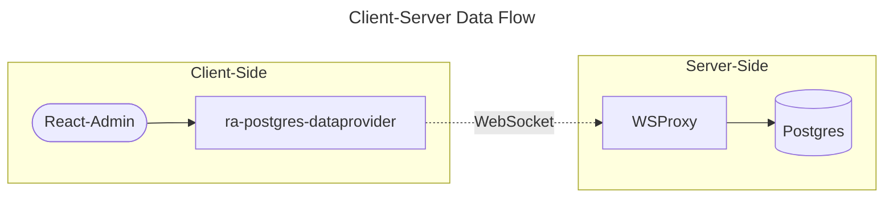

# ra-postgres-dataprovider
React-Admin Postgres Data Provider

## Requirements
[node-postgres](https://github.com/brianc/node-postgres) is server side only.

To work on the client side, then the combination of
[Neon WSProxy](https://github.com/neondatabase/wsproxy) and
[Neon Serverless](https://github.com/neondatabase/serverless)



## Sample
```jsx
import { useEffect, useState } from 'react'
import { Admin, EditGuesser, ListGuesser, Loading, Resource } from 'react-admin'
import dataProviderFactory from 'ra-postgres-dataprovider'

// use node-postgres
import { Pool } from 'pg'

// or use Neon
import { Pool, neonConfig } from '@neondatabase/serverless'
neonConfig.wsProxy = (host, port) => `wsproxy/v1?address=${host}:${port}`
neonConfig.useSecureWebSocket = true

const DATABASE_URL = process.env.DATABASE_URL

export default () => {
  const [dataProvider, setDataProvider] = useState(null)

  useEffect(()=>{
    const startDataProvider = async () => {
      const pool = new Pool({
        connectionString: DATABASE_URL,
        max: 2,
      })
      await pool.connect()
      await pool.query("set schema 'public'")
      setDataProvider(dataProviderFactory(pool));
    }

    if (dataProvider === null) {
      startDataProvider();
    }
  }, [dataProvider])

  if (dataProvider === null) return <Loading />

  return (
    <>
      <Admin dataProvider={dataProvider}>
        <Resource name="example-table" list={ListGuesser} edit={EditGuesser}/>
      </Admin>
    </>
  )
}
```
